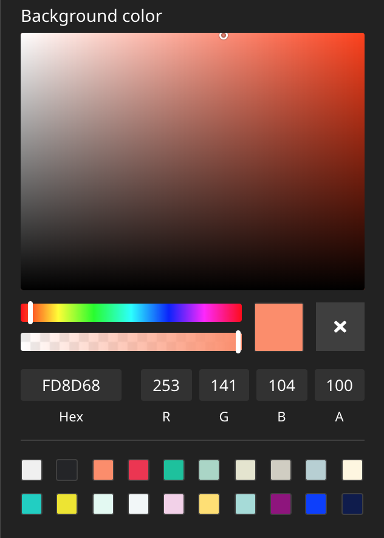

# Color Picker Editor for Neos CMS    

[](https://packagist.org/packages/shel/neos-colorpicker)
[](https://packagist.org/packages/shel/neos-colorpicker)
[](https://packagist.org/packages/shel/neos-colorpicker)

## Introduction

This package provides a Color Picker Editor which can be used
in Neos CMS with the Neos.Ui 2+.

This editor is based on the example in https://github.com/neos/neos-ui-extensibility-examples but 
has some modifications in regards to styling, supports the alpha channel and has a reset button to
unset a value.

## Example           

See it in [action](https://vimeo.com/327331115).

  

## Installation

Run this in your site package

```console
composer require --no-update shel/neos-colorpicker
```

Then run `composer update` in your project directory.

## How to use

Add a property of type string and configure the editor as seen in this example:

```yaml
"My.Site:Content.Text":
  superTypes:
    "Neos.Neos:Content": true
  ui:
    label: 'My text content'
  properties:
    textColor:
      type: string
      ui:
        label: 'Text color'
        reloadIfChanged: true
        inspector:
          group: 'text'
          editor: 'Shel.Neos.ColorPicker/ColorPickerEditor'
          editorOptions:
            # `mode` can be one of "rgba", "hsla", "hex", default: rgba
            mode: 'rgba'
            # Show saturation/hue/alpha (optional), boolean, default: false
            picker: true
            # Show hex/rgba fields (optional), boolean, default: false
            fields: true
            # Show preset colors (optional), array of colors or boolean (to disable)
            presetColors: ['#ff0000', '#0000ff', '#ffff00', ...]
            # Hides the reset button if set to false
            allowEmpty: true
```              
## Customization

The editor allows some customization options via your `Settings.yaml` file:

```yaml
Neos:
 Neos:
  Ui:
   frontendConfiguration:
    "Shel.Neos:ColorPickerEditor":
     # `mode` can be one of "rgba", "hsla", "hex"
     mode: "rgba"
     # Colors which are available for quick selection
     presetColors: ["#D0021B", "#F5A623", ...]
```              
              
`mode` allows you to store the selected color values in a different format if needed. 
This can be helpful, when the hsl format is needed to get the individual components.

`presetColors` lets you customize the list of color squares that are available for quick selection.
  

## Contributions

Contributions are very welcome! 

Please create detailed issues and PRs.
